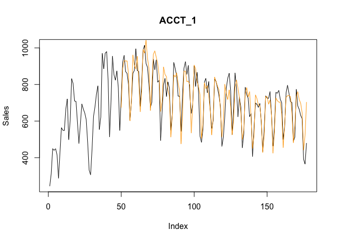

Time Series Forecasting with with ARIMA and Prophet
================

``` r
library(rmarkdown)
library(forecast)  
library(prophet)
library(ggplot2)  

sales <- read.csv("ppc_sales_by_accounts.csv", stringsAsFactors = F)
sales$Date <- as.Date(sales$Date)
```

Data consists of daily sales in 6 months from 5 different accounts. They seem to have periodical patterns in every 7 days, we can further use auto-correlation plot to verify it

``` r
ggplot(sales, aes(Date, Sales, color = Account)) + geom_line() + ylab("Daily Sales")
```


``` r
## zoom in on one of the accounts
ggplot(sales[sales$Account == "ACCT_3" & sales$Date >= "2017-04-15", ], aes(Date, Sales)) + geom_line() + ylab("Daily Sales")
```


From the ACF and Partial ACF plots we can see whether the series is auto-correlative, in this case, daily sales is correlated significantly to yesterday and 6 days ago, and silightly correlated to 2 days ago and 8 days ago. It implicitly shows weekly seasonality even it doesn't have strong correlationship with data on 7 days ago because data on 6 days ago is highly correlated to its yesterday and PACF removes the effects that are already explained.

``` r
acf(sales[sales$Account == "ACCT_3", "Sales"])
```


``` r
pacf(sales[sales$Account == "ACCT_3", "Sales"])
```


Next, we firstly build a ARIMA model, instead of assigning predetermined orders of AR and MA as regressors, we train with `auto.arima` function from `forecast` package which would stepwise traverse different orders of AR/MA and return the one with minimal Akaike information criterion(AICc) as an act of feature selection.

``` r
## create ARIMA model that would roll forward each day and predict the value of the next day until the end of series 

arima_fc <- function(series) {
n <- 7 ## seven weeks window as training set
ntrain <- length(series) - (n*7)
pred_v <- numeric(ntrain)
for (i in 1:ntrain) {
  data <- ts(series[i:(n*7+i-1)], frequency = 7)  ## daily sales have a cycle of every 7 days
  ARIMAfit = auto.arima(data, max.d = 1, trace = FALSE, ic = "aicc")  
  ## (1) selecting features based on lowest aicc (2) reduce computation time by limit number of differences to 1
  pred = forecast(ARIMAfit, h = 1)
  pred_v[i] <- pred$mean
}

pred_tmr <- c(rep(NA, n*7), pred_v)
RMSE <- sqrt(mean((series - pred_tmr)^2, na.rm = T))
MAPE <- 100 * mean(abs((series - pred_tmr)/series), na.rm = T)

return(list(model = ARIMAfit$coef, prediction = pred_tmr, rmse = RMSE, mape = MAPE))
}
```

The RMSE of the forecast from ARIMA model is 82.4, the tunned models of these 5 series have commonly one seasonal term, MA for most of the time, and one non-seasonal term, either AR or MA.

``` r
rmse_arima <- c()
model_arima <- list()

for (x in unique(sales$Account)) {
  result <- arima_fc(sales[sales$Account == x, "Sales"])
  rmse_arima <- append(rmse_arima, result$rmse)
  model_arima[[x]] <- result$model
  
  plot(sales[sales$Account == x, "Sales"], type = "l", ylab = "Sales", main = x) 
  lines(result$prediction, col = 'orange')
}
```


``` r
print(mean(rmse_arima))
```

    ## [1] 82.44535

``` r
print(model_arima)
```

    ## $ACCT_1
    ##        ma1        ma2 
    ## -1.1665421  0.6188275 
    ## 
    ## $ACCT_2
    ##        ma1       sma1 
    ## -0.6843286 -0.8166839 
    ## 
    ## $ACCT_3
    ##        ar1        ar2        ma1       sma1 
    ##  1.4908613 -0.6853101 -0.8472283 -0.8622629 
    ## 
    ## $ACCT_4
    ##        ar1       sar1 
    ##  0.6228185 -0.5655073 
    ## 
    ## $ACCT_5
    ##         ar1        sma1   intercept 
    ##   0.4866501   0.2852768 961.5358877

Next, we will build forecasts with `Prophet`. For starters, we leave the paramters as defaults except for turning on weekly seasonality and turning off daily and yearly seasonality because we can only observe weekly patterns in the series, then we can fine tune the parameters based on the results.

``` r
## create Prophet model that would roll forward each day and predict the value of the next day until the end of series 

prophet_fc <- function(df) {
names(df) <- c("ds", "y")  ## rename columns as prophet requires 
n <- 7  ## seven weeks window as training set
ntrain <- nrow(df) - (n*7)
pred_v <- numeric(ntrain)

for (i in 1:ntrain) {
  m <- prophet(df[i:(n*7+i-1), ], daily.seasonality = FALSE, yearly.seasonality = FALSE, weekly.seasonality = TRUE)  
  ## data is too short to capture yearly seasonality and not granular enough to capture daily seasonality
  future <- make_future_dataframe(m, periods = 1)
  pred <- predict(m, future, daily)
  pred_v[i]  <- tail(pred$yhat, 1)
}

pred_tmr <- c(rep(NA, n*7), pred_v)
RMSE <- sqrt(mean((df$y - pred_tmr)^2, na.rm = T))
MAPE <- 100 * mean(abs((df$y - pred_tmr)/df$y), na.rm = T)

return(list(prediction = pred_tmr, rmse = RMSE, mape = MAPE))
}
```

The RMSE of Prophet is 89, slightly worse than ARIMA. When we look at the forecast plot vs. actual, it tends to underpredict at peaks and overpreidct at troughs, the magnitude of the swings is more conservative. So we tune up the `seasonality.prior.scale` to 20 and 50. However it doesn't seem to have much impact on the forecast, especially when our forecast window has only one day.

``` r
rmse_prophet <- c()

for (x in unique(sales$Account)) {
  result <- prophet_fc(sales[sales$Account == x, c("Date", "Sales")])
  rmse_prophet <- append(rmse_prophet, result$rmse)
  
  plot(sales[sales$Account == x, "Sales"], type = "l", ylab = "Sales", main = x) 
  lines(result$prediction, col = 'orange')
}
```


``` r
print(mean(rmse_prophet))
```

    ## [1] 89.0005

Lastly, we build an ensemble model which combines the prediction from ARIMA and Prophet together by averaging them out. It shows 78.85 in RMSE which is the best model among these three, proving that ensemble method often performs better in predictions than the best individual model.

``` r
ensemble_fc <- function(df) {

names(df) <- c("ds", "y")  
n <- 7  
ntrain <- nrow(df) - (n*7)
pred_v <- numeric(ntrain)

for (i in 1:ntrain) {
  ## ARIMA
  data <- ts(df[i:(n*7+i-1), "y"], frequency = 7)  
  ARIMAfit = auto.arima(data, max.d = 1, trace = FALSE, ic = "aicc")  
  pred_arima = forecast(ARIMAfit, h = 1)
  
  ## Prophet
  m <- prophet(df[i:(n*7+i-1), ], daily.seasonality = FALSE, yearly.seasonality = FALSE, weekly.seasonality = TRUE)  
  future <- make_future_dataframe(m, periods = 1)
  pred_prophet <- predict(m, future, daily)
  
  ## average the predictions of two
  pred_v[i]  <- (pred_arima$mean + tail(pred_prophet$yhat, 1))/2
}

pred_tmr <- c(rep(NA, n*7), pred_v)
RMSE <- sqrt(mean((df$y - pred_tmr)^2, na.rm = T))
MAPE <- 100 * mean(abs((df$y - pred_tmr)/df$y), na.rm = T)

return(list(prediction = pred_tmr, rmse = RMSE, mape = MAPE))
}
```

``` r
rmse_ensemble <- c()

for (x in unique(sales$Account)) {
  result <- ensemble_fc(sales[sales$Account == x, c("Date", "Sales")])
  rmse_ensemble <- append(rmse_ensemble, result$rmse)
  
  plot(sales[sales$Account == x, "Sales"], type = "l", ylab = "Sales", main = x) 
  lines(result$prediction, col = 'orange')
}
```



``` r
print(mean(rmse_ensemble))
```

    ## [1] 78.85121
